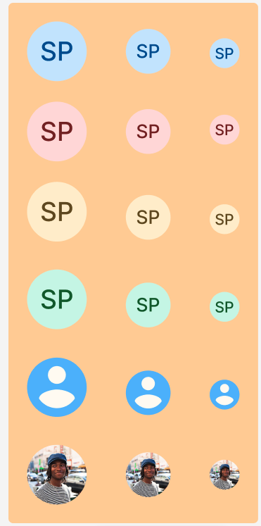

## Các thuộc tính

Component sử dụng các thuộc tính đã được định nghĩa sẵn, ngoài ra người dùng có thể custom lại style


```tsx
    interface AvatarProps {
    children?: React.ReactNode;
    name?: string;
    borderColor?: string;
    backgroundColor?: string;
    style?: StyleProp<ViewStyle>;
    textColor?: string;
    size: 64 | 48 | 24;
    source?: string;
    onPress?: () => void;
    textStyle?: StyleProp<TextStyle>;
    imageStyle?: StyleProp<ImageStyle>;
}
```

## Sử dụng

```tsx
import { Avatar } from 'sapo-components-ui-rn';

function MyComponent() {
  return (
    <Button disabled textStyle={{...}}  title="My Button" onPress={()=> {}}/>
  );
}
```
