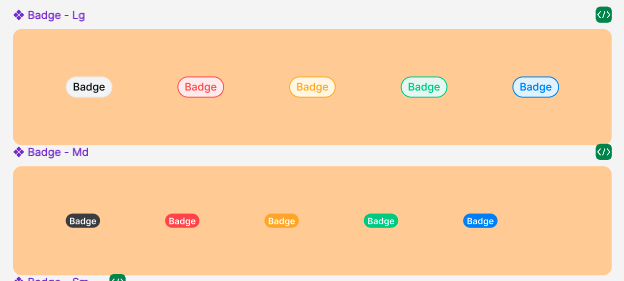

## Các thuộc tính

Component sử dụng các thuộc tính đã được định nghĩa sẵn, ngoài ra người dùng có thể custom lại style



```tsx
    interface BadgeProps {
    children?: React.ReactNode;
    value: string;
    borderColor?: string;
    backgroundColor?: string;
    style?: StyleProp<ViewStyle>;
    textColor?: string;
    textStyle?: StyleProp<TextStyle>;
  }
```

## Sử dụng

```tsx
import { Badge } from 'sapo-components-ui-rn';

function MyComponent() {
  return (
    <Badge
      value="100"
      style={{
        backgroundColor: colors.backgroundPrimary,
      }}
      // textColor={colors.textDefault}
    />
  );
}
```
