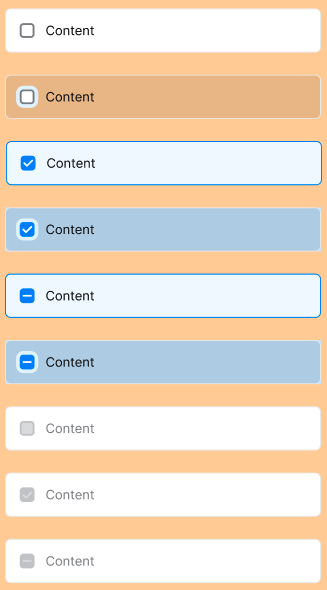

## Các thuộc tính

Component sử dụng các thuộc tính đã được định nghĩa sẵn, ngoài ra người dùng có thể custom lại style


```tsx
interface CheckboxProps {
  style?: StyleProp<ViewStyle>;
  content: string;
  onPress?: (val?: any) => void;
  textStyle?: StyleProp<TextStyle>;
  disabled?: boolean;
  leftIcon?: React.ReactNode;
  checked?: boolean;
  iconSize?: number;
}
```

## Sử dụng

```tsx
import { Checkbox } from 'sapo-components-ui-rn';

function MyComponent() {
  return (
    <Checkbox content="Checkbox" checked={true} />
  );
}
```
