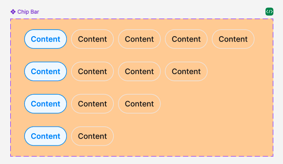

## Các thuộc tính

Component sử dụng các thuộc tính đã được định nghĩa sẵn, ngoài ra người dùng có thể custom lại style


```tsx
interface ChipBarProps {
  style?: StyleProp<ViewStyle>;
  title: string;
  borderRadius?: number;
  onPress?: (val?: any) => void;
  textStyle?: StyleProp<TextStyle>;
  disabled?: boolean;
  leftIcon?: React.ReactNode;
  rightIcon?: React.ReactNode;
  badge?: number;
  isActive?: boolean;
}
```

## Sử dụng

```tsx
import { ChipBar } from 'sapo-components-ui-rn';

function MyComponent() {
  return (
    <ChipBar
      disabled
      title="Chip bar"
      style={{
        borderColor: colors.borderInfoDefault,
        backgroundColor: colors.surfaceInfoInverseDefault,
      }}
      leftIcon={
        <SvgIcon
          name="IconCloseCircle"
          width={16}
          height={16}
          color={colors.iconBrandDefault}
        />
      }
      textStyle={{
        color: colors.textInfoDefault,
      }}
    />
  );
}
```
