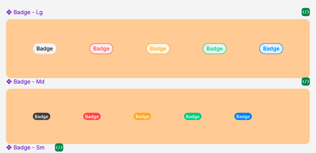

## Các thuộc tính

Component sử dụng các thuộc tính đã được định nghĩa sẵn, ngoài ra người dùng có thể custom lại style


```tsx
interface CountingDotProps {
  children?: React.ReactNode;
  value: string | number;
  borderColor?: string;
  backgroundColor?: string;
  style?: StyleProp<ViewStyle>;
  textColor?: string;
  textStyle?: StyleProp<TextStyle>;
}
```

## Sử dụng

```tsx
import { CountingDot } from 'sapo-components-ui-rn';

function MyComponent() {
  return (
    <CountingDot value={10} />
  );
}
```
