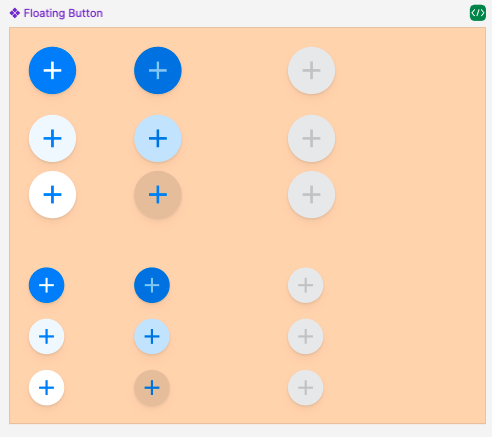

## Các thuộc tính

Component sử dụng các thuộc tính đã được định nghĩa sẵn, ngoài ra người dùng có thể custom lại style


```tsx
export interface FloatingButtonProps {
  isLoading?: boolean;
  disabled?: boolean;
  onPress?: (val?: any) => void;
  style?: StyleProp<ViewStyle>;
  children?: React.ReactNode;
  size?: number;
  hiddenBackground?: boolean;
  props?: object;
  backgroundColor?: string;
  top?: number;
  right?: number;
}
```

## Sử dụng

```tsx
import { FloatingButton } from 'sapo-components-ui-rn';

function MyComponent() {
  return (
    <FloatingButton bottom={20} right={20}>
    {...Icon}
    </FloatingButton>
  );
}
```
