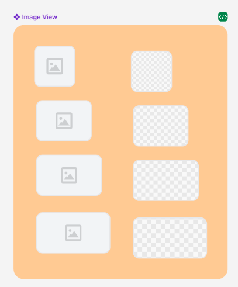

## Các thuộc tính

Component sử dụng các thuộc tính đã được định nghĩa sẵn, ngoài ra người dùng có thể custom lại style


```tsx
interface PropsCustomImage extends ImageProps {
  useFastImage?: boolean;
  disableDefaultImage?: boolean;
  children?: React.ReactNode;
  resizeMode?: "cover" | "contain" | "stretch" | "center";
  source: any;
  style?: StyleProp<ImageStyle>;
  loadingColor?: string;
  showLoading?: boolean;
}
```

## Sử dụng

```tsx
import { Image } from 'sapo-components-ui-rn';

function MyComponent() {
  return (
     <Image
        source={"https:/assets/images/logo.png"}
        style={{ width: 100, height: 100 }}
        />
  );
}
```
