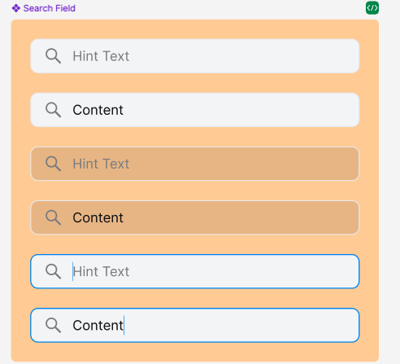

## Các thuộc tính

Component sử dụng các thuộc tính đã được định nghĩa sẵn, ngoài ra người dùng có thể custom lại style


```tsx
interface SearchInputProps {
  style?: StyleProp<ViewStyle>;
  value?: string;
  placeholder?: string;
  textStyle?: StyleProp<TextStyle>;
  disabled?: boolean;
  leftIcon?: React.ReactNode;
  rightIcon?: React.ReactNode;
  clearButton?: boolean;
  onFocus?: () => void;
  onBlur?: () => void;
  onChangeText?: (text: string) => void;
}
```

## Sử dụng

```tsx
import { SearchInput } from 'sapo-components-ui-rn';

function MyComponent() {
  return (
    <SearchInput placeholder="Search" />
  );
}
```
