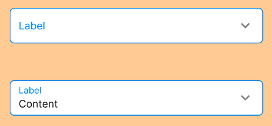

## Các thuộc tính

Component sử dụng các thuộc tính đã được định nghĩa sẵn, ngoài ra người dùng có thể custom lại style



```tsx
export interface SelectionFieldProps extends TouchableOpacityProps {
  style?: StyleProp<ViewStyle>;
  borderColor?: string;
  content?: string;
  label?: string;
  error?: string;
  left?: React.ReactNode;
  right?: React.ReactNode;
  textProps?: IText;
  textColor?: string;
  labelColor?: string;
  size?: number;
  textStyle?: TextStyle;
  labelStyle?: TextStyle;
  disabled?: boolean;
  onPress?: (res?: any) => void;
  theme?: ThemeProp;
}
```

## Sử dụng

```tsx
import { SelectionField } from 'sapo-components-ui-rn';

function MyComponent() {
  return (
    <SelectionField label="Selection Field" />
  );
}
```
