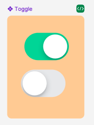

## Các thuộc tính

Component sử dụng các thuộc tính đã được định nghĩa sẵn, ngoài ra người dùng có thể custom lại style

 


```tsx
export type Props = React.ComponentPropsWithRef<typeof NativeSwitch> & {
  /**
   * Disable toggling the switch.
   */
  disabled?: boolean;
  /**
   * Value of the switch, true means 'on', false means 'off'.
   */
  value?: boolean;
  /**
   * Custom color for switch.
   */
  color?: string;
  /**
   * Callback called with the new value when it changes.
   */
  onValueChange?: Function;
  style?: StyleProp<ViewStyle>;
  /**
   * @optional
   */
  theme?: ThemeProp;
};
```

## Sử dụng

```tsx
import { Switch } from 'sapo-components-ui-rn';

function MyComponent() {
  return (
    <Switch value={true} />
  );
}
```
