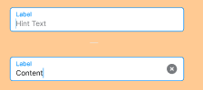

## Các thuộc tính

Component sử dụng các thuộc tính đã được định nghĩa sẵn, ngoài ra người dùng có thể custom lại style

 


```tsx

export type Props = React.ComponentPropsWithRef<typeof NativeTextInput> & {
  mode?: "flat";
  left?: React.ReactNode;
  right?: React.ReactNode;
  /**
   * If true, user won't be able to interact with the component.
   */
  disabled?: boolean;
  /**
   * The text or component to use for the floating label.
   */
  label?: TextInputLabelProp;
  /**
   * Placeholder for the input.
   */
  placeholder?: string;
  /**
   * Whether to style the TextInput with error style.
   */
  error?: boolean;
  /**
   * Callback that is called when the text input's text changes. Changed text is passed as an argument to the callback handler.
   */
  onChangeText?: Function;
  /**
   * Selection color of the input. On iOS, it sets both the selection color and cursor color.
   * On Android, it sets only the selection color.
   */
  selectionColor?: string;
  /**
   * @platform Android only
   * Cursor (or "caret") color of the input on Android.
   * This property has no effect on iOS.
   */
  cursorColor?: string;
  /**
   * Inactive underline color of the input.
   */
  underlineColor?: string;
  /**
   * Active underline color of the input.
   */
  activeUnderlineColor?: string;
  /**
   * Inactive outline color of the input.
   */
  outlineColor?: string;
  /**
   * Active outline color of the input.
   */
  activeOutlineColor?: string;
  /**
   * Color of the text in the input.
   */
  textColor?: string;

  placeholderTextColor?: string;
  /**
   * Sets min height with densed layout. For `TextInput` in `flat` mode
   * height is `64dp` or in dense layout - `52dp` with label or `40dp` without label.
   * For `TextInput` in `outlined` mode
   * height is `56dp` or in dense layout - `40dp` regardless of label.
   * When you apply `height` prop in style the `dense` prop affects only `paddingVertical` inside `TextInput`
   */
  dense?: boolean;

  /**
   * @platform Android only
   * The number of lines to show in the input (Android only).
   */
  numberOfLines?: number;
  /**
   * Callback that is called when the text input is focused.
   */
  onFocus?: (args: any) => void;
  /**
   * Callback that is called when the text input is blurred.
   */
  onBlur?: (args: any) => void;
  /**
   *
   * Callback to render a custom input component such as `react-native-text-input-mask`
   * instead of the default `TextInput` component from `react-native`.
   *
   * Example:
   * ```js
   * <TextInput
   *   label="Phone number"
   *   render={props =>
   *     <TextInputMask
   *       {...props}
   *       mask="+[00] [000] [000] [000]"
   *     />
   *   }
   * />
   * ```
   */
  render?: (props: RenderProps) => React.ReactNode;
  /**
   * Value of the text input.
   */
  value?: string;
  /**
   * Pass `fontSize` prop to modify the font size inside `TextInput`.
   * Pass `height` prop to set `TextInput` height. When `height` is passed,
   * `dense` prop will affect only input's `paddingVertical`.
   * Pass `paddingHorizontal` to modify horizontal padding.
   * This can be used to get MD Guidelines v1 TextInput look.
   */
  style?: StyleProp<TextStyle>;
  /**
   * @optional
   */
  theme?: ThemeProp;
  /**
   * testID to be used on tests.
   */
  testID?: string;
  /**
   * Pass custom style directly to the input itself.
   * Overrides input style
   * Example: `paddingLeft`, `backgroundColor`
   */
  contentStyle?: StyleProp<TextStyle>;
  /**
   * Pass style to override the default style of outlined wrapper.
   * Overrides style when mode is set to `outlined`
   * Example: `borderRadius`, `borderColor`
   */

  underlineStyle?: StyleProp<ViewStyle>;
  minHeight?: number;
  clearButton?: boolean;
};
```

## Sử dụng

```tsx
import { TextInput } from 'sapo-components-ui-rn';

function MyComponent() {
  return (
      <TextInput
        placeholder="Username"
        clearButton
        label={"username"}
        mode="flat"
      />
  );
}
```
