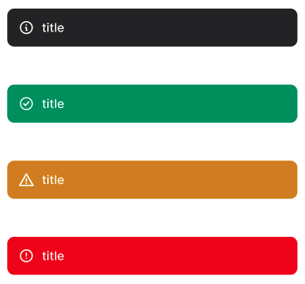

## Các thuộc tính

Component sử dụng các thuộc tính đã được định nghĩa sẵn, ngoài ra người dùng có thể custom lại style

 


```tsx

const POSITION = {
  TOP: "top",
  BOTTOM: "bottom",
} as const;

type Position = (typeof POSITION)[keyof typeof POSITION];
type ToastType = "success" | "error" | "info" | "warning";

interface Notification {
  message?: string;
  duration?: number;
  position?: Position;
  type?: ToastType;
  title: string;
  onPress?: () => void;
}

interface ToastOptions {
  position: Position;
  type: ToastType;
  title?: string;
  onPress?: () => void;
}

```

## Sử dụng

```tsx
import { showToast } from 'sapo-components-ui-rn';

function MyComponent() {

  const handleShowToast = () => {
    showToast({
      title: "Thông báo",
      message: "Tải ảnh thành công",
      position: "top",
      type: "warning",
    });
  };

  return (
      <Button onPress={handleShowToast}/>
  );
}
```
